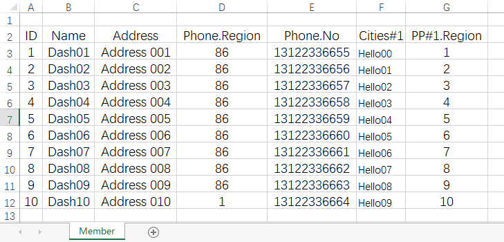

# xlsxcfg

xlsxcfg load config data from excel sheets.

## Installation

Use one of the following ways:

1. Download from [release](https://github.com/dashengyeah/xlsxcfg/releases).
Recommend to add it to your `PATH` env.

2. Run the following command:
*⚠need golang sdk installed*

`go install github.com/dashengyeah/xlsxcfg/bin/xlsxcfg`

## Config

Default config file `xlsxcfg.yaml`:

```yaml
# Protocol Buffer source config
proto:
  # proto files need to parse.
  files: ["example.proto"]
  # proto message import paths.
  import_path: ["."]
# xlsx sheet config
sheet:
  # rows that is comment, will ignore
  # in parsing
  comment_rows: [1]
  # row contains metadata
  meta_row: 2
  # rows contain config data from this
  data_row_start: 3
  # sheet name should add this suffix
  # to find the proto message.
  type_suffix: "Sheet"
  # config data rows' list name in the
  # sheet proto message.
  list_field_name: "List"
  # sheet name should add this suffix
  # to find the data row proto message.
  row_type_suffix: "SheetRow"
# output file config
output:
  # output dir
  dir: "."
  # json
  write_json: true
  json_indent: "  "
  # proto bytes
  write_bytes: true
```

## Examples

1. Basic

- Protocol Buffer code:

```protobuf
message PhoneNumber {
    int64  Region = 1;
    int64  No     = 2;
    string Ext    = 3;
}

message MemberSheetRow {
    int32                ID      = 1;
    string               Name    = 2;
    string               Address = 3;
    PhoneNumber          Phone   = 4;
    repeated string      Cities  = 5;
    repeated PhoneNumber PP      = 6;
}
message MemberSheet {
    repeated MemberSheetRow List = 1;
}
```

- Excel sheet:


