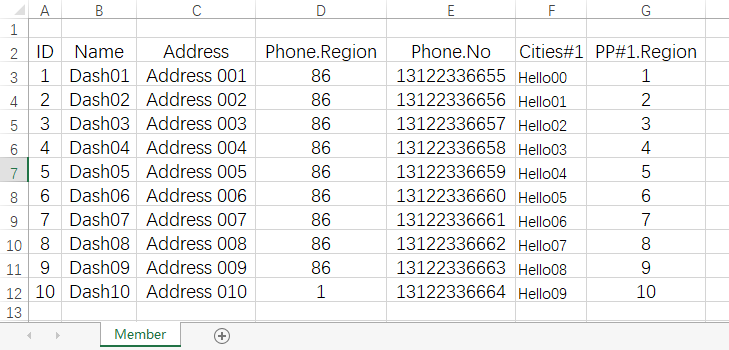

# xlsxcfg

xlsxcfg is a Go CLI that converts Excel (.xlsx) sheets into Protocol Buffer-defined config data (JSON, msgpack, protobuf binary). It parses `.proto` files at runtime — no `protoc`-gen step needed.

Protocol Buffer is **optional**. Without proto, xlsxcfg outputs raw JSON and msgpack from the parsed xlsx data.

## Installation

1. Download from [releases](https://github.com/das6ng/xlsxcfg/releases).

    Recommended to add it to your `PATH` env.

2. Build from source (*requires [Go](https://go.dev/) 1.26+*):

    `go install github.com/das6ng/xlsxcfg/bin/xlsxcfg@latest`

## Usage

```
Usage:
  xlsxcfg [flags] [xlsx files...]

Flags:
  -c, --config string    config file (default "xlsxcfg.yaml")
      --example-config   print example config to stdout
  -h, --help             help for xlsxcfg
```

Any unrecognized `--key=value` flags are deep-merged into the config (see [Dynamic flags](#dynamic-flags)).

### Quick start

Dir structure:

```
./
├── proto/
│   └── example.proto
├── example.xlsx
└── xlsxcfg.yaml
```

1. With explicit config:

    `xlsxcfg -c xlsxcfg.yaml example.xlsx`

2. Config file defaults to `xlsxcfg.yaml` in the current directory:

    `xlsxcfg example.xlsx`

3. Multiple xlsx files at once:

    `xlsxcfg -c xlsxcfg.yaml example.xlsx example1.xlsx example2.xlsx`

4. Without proto — raw JSON output only:

    `xlsxcfg --proto.enabled=false example.xlsx`

## Config

Print an example config with all options and comments:

```
xlsxcfg --example-config
```

Full config reference:

```yaml
# Protocol Buffer source config
proto:
  # Set true to enable proto-based output formats.
  enabled: true
  # Proto files to parse at runtime.
  files: ["example.proto"]
  # Proto import paths.
  import_path: ["."]

# xlsx sheet config
sheet:
  # Row indices (1-based) to skip as comments.
  comment_rows: [1]
  # Row index (1-based) containing column metadata.
  meta_row: 2
  # First row index (1-based) of config data.
  data_row_start: 3
  # Suffix appended to sheet name to find the
  # wrapper proto message.
  type_suffix: "Sheet"
  # Field name for the row list inside the
  # wrapper message.
  list_field_name: "List"
  # Suffix appended to sheet name to find the
  # per-row proto message.
  row_type_suffix: "SheetRow"
  # Optional prefix or suffix that marks a sheet for
  # transposed parsing (column-per-record).
  # e.g. "~" means sheet "Hero~" or "~Hero" is parsed
  # column-wise. The mark is stripped before
  # proto type lookup and output file naming.
  transpose_mark: ""

# Output file config
output:
  dir: "."
  # Field order for proto-validated output:
  # "schema" (default) — order by proto field number
  # "source" — order by xlsx source column order
  field_order: "schema"
  # Raw JSON (no proto required)
  raw_json:
    enabled: true
    dir: ""
    extension: ".json"
    indent: "  "
  # Raw msgpack (no proto required)
  raw_msgpack:
    enabled: false
    dir: ""
    extension: ".msgpack"
  # Proto JSON (requires proto)
  json:
    enabled: false
    dir: ""
    extension: ".json"
    indent: "  "
  # Proto msgpack (requires proto)
  msgpack:
    enabled: false
    dir: ""
    extension: ".msgpack"
  # Protobuf binary (requires proto)
  pb_bytes:
    enabled: false
    dir: ""
    extension: ".bytes"
```

### Output formats

| Format | Key | Proto required | Extension | Description |
|--------|-----|---------------|-----------|-------------|
| Raw JSON | `raw_json` | No | `.json` | `map[string]any` → JSON |
| Raw Msgpack | `raw_msgpack` | No | `.msgpack` | `map[string]any` → msgpack |
| Proto JSON | `json` | Yes | `.json` | `dynamicpb` → protojson |
| Proto Msgpack | `msgpack` | Yes | `.msgpack` | proto → JSON → msgpack |
| Protobuf Binary | `pb_bytes` | Yes | `.bytes` | `proto.Marshal` binary |

### Dynamic flags

Any `--key=value` flag not recognized by the CLI is deep-merged into the config via YAML round-trip:

```sh
# Override nested fields with dot-separated paths
xlsxcfg example.xlsx --output.raw_json.enabled=false
xlsxcfg example.xlsx --output.pb_bytes.enabled=true

# Override arrays
xlsxcfg example.xlsx --sheet.comment_rows=[1,2]
```

## Examples

### Basic

Proto definition:

```protobuf
message PhoneNumber {
    int64  Region = 1;
    int64  No     = 2;
    string Ext    = 3;
}

message MemberSheetRow {
    int32                ID      = 1;
    string               Name    = 2;
    string               Address = 3;
    PhoneNumber          Phone   = 4;
    repeated string      Cities  = 5;
    repeated PhoneNumber PP      = 6;
}
message MemberSheet {
    repeated MemberSheetRow List = 1;
}
```

Excel sheet:



### Enum fields

Enum fields support both integer values and **name resolution** in cells:

```protobuf
enum Status {
    UNKNOWN = 0;
    ACTIVE  = 1;
    INACTIVE = 2;
}

message HeroSheetRow {
    int32  ID     = 1;
    string Name   = 2;
    Status Status = 3;
}
```

Cells can contain `1` or `ACTIVE` — both resolve to the same enum value.

### Transposed sheets

Set `transpose_mark` (e.g. `"~"`) to parse sheets column-wise — each column becomes one record instead of each row. The mark can be a **prefix** or **suffix** of the sheet name. Useful for data laid out horizontally in xlsx.

Sheets `Hero~` or `~Hero` with `transpose_mark: "~"`:
- Column indices follow the same `comment_rows` / `meta_row` / `data_row_start` rules as row indices in normal mode.
- The mark is stripped for proto type lookup (`HeroSheetRow`) and output file naming (`Hero.json`).
